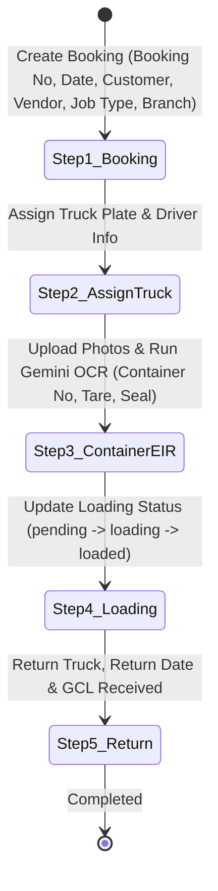
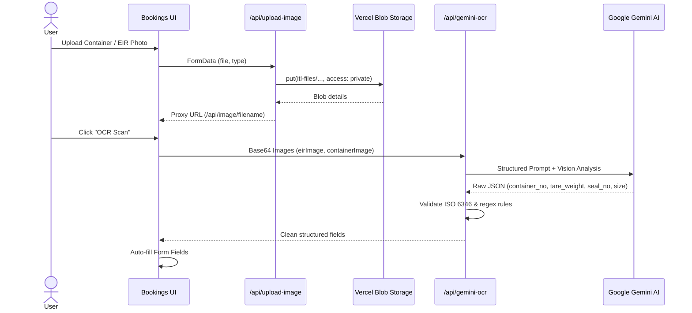
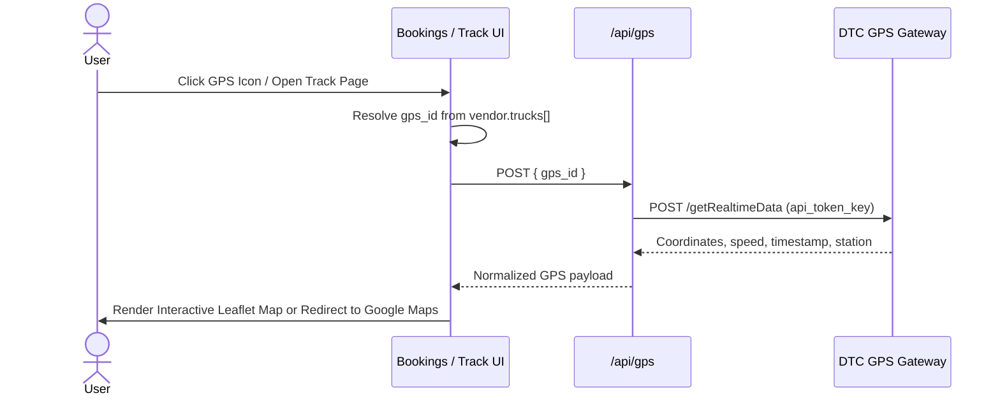

# Architecture & System Design

This document details the software architecture, data models, authentication & authorization mechanisms, state flows, and component structure for the ITL FCL Management system.

---

## 1. System Overview

The system is designed as an operational dashboard for Full Container Load (FCL) freight logistics with integrated Role-Based Access Control (RBAC).

```mermaid
graph TD
    Client["Next.js 16 Web App (React 19)"]
    AuthGate["AuthGate (Session / RBAC Guard)"]
    API["Next.js Route Handlers (/src/app/api)"]
    Mongo[("MongoDB Database (eir_scanner)")]
    Blob[("Vercel Blob Storage")]
    Gemini["Google Gemini AI (OCR Engine)"]
    DTC["DTC GPS Telematics Gateway"]

    Client -->|Check Session| AuthGate
    AuthGate -->|Redirect /login if needed| Client
    Client -->|CRUD + Auth Headers (role, branch)| API
    Client -->|Direct Upload| API
    API -->|Read/Write Operations (Branch Scoped)| Mongo
    API -->|Store & Stream Images| Blob
    API -->|Multi-image OCR| Gemini
    API -->|Telemetry & Locations| DTC
```

---

## 2. Directory Layout & Architecture

```text
src/
├── app/
│   ├── layout.tsx                     # Root HTML shell & fonts
│   ├── globals.css                    # Tailwind CSS v4 directives
│   ├── page.tsx                       # Root entrypoint (redirects to /bookings)
│   ├── login/                         # Authentication page
│   │   └── page.tsx                   # Login form with user credentials & demo accounts
│   ├── (dashboard)/                   # Protected Dashboard route group (with AppShellLayout)
│   │   ├── layout.tsx                 # Responsive shell with collapsible Sidebar & user profile
│   │   ├── bookings/                  # Booking Hub (CRUD, OCR, Workflow modal)
│   │   │   ├── page.tsx               # Orchestrator component
│   │   │   ├── components/            # Sub-components: BookingRow, StepBar, ProcessModalFields, etc.
│   │   │   ├── hooks/useBookings.ts   # Custom hook managing booking lifecycle & filters
│   │   │   ├── types/booking-form.ts  # Form state and validation interfaces
│   │   │   └── utils/booking-utils.ts # Formatters, proxy helpers, and presets
│   │   ├── customers/page.tsx         # Customer master data management (with branch)
│   │   ├── vendors/page.tsx           # Vendor, truck (gps_id) & driver management (with branch)
│   │   ├── containers/page.tsx        # Container code & size management (with branch)
│   │   └── drivers/[id]/page.tsx      # Driver profile (personal view vs admin view)
│   ├── gps/
│   │   └── track/[plate]/page.tsx     # Direct GPS map tracker per truck plate
│   └── api/                           # Backend API route handlers
│       ├── collections/[collection]/  # Generic GET (pagination/filters/branch) & POST
│       ├── collections/[collection]/[id]/ # PUT & DELETE by ObjectId
│       ├── bookings/container/        # ISO 6346 container patch endpoint
│       ├── gemini-ocr/                # Gemini multi-image extraction route
│       ├── upload-image/              # Vercel Blob uploader
│       ├── image/[filename]/          # Blob private image proxy
│       ├── gps/                       # Realtime GPS location endpoint
│       ├── gps/history/               # DTC station-to-station report endpoint
│       └── gps/history-raw/           # DTC raw history telemetry endpoint
├── components/                        # Shared UI components (Sidebar, AuthGate, GpsMap, ImageUpload)
└── lib/                               # Core utilities: types.ts, mongodb.ts, api.ts, dtcGps.ts
```

---

## 3. Authentication & Role-Based Access Control (RBAC)

### A. Auth Architecture & Session Lifecycle

1. **Unauthenticated Access**: When a user accesses any protected dashboard route, `AuthGate` (`src/components/AuthGate.tsx`) checks `sessionStorage.getItem("itl_user")`. If missing, the user is redirected to `/login`.
2. **Login Process** (`src/app/login/page.tsx`):
   - User inputs credentials.
   - On successful authentication, session object is written to `sessionStorage`:
     ```json
     {
       "username": "administrator@fls.com",
       "name": "ITL Administrator",
       "role": "admin",
       "branch": "Bangkok",
       "isLoggedIn": true
     }
     ```
   - User is redirected to `/`.

### B. User Roles & Permissions Matrix

| Capability / Resource | `admin` | `leader` | `driver` |
|---|---|---|---|
| View All Company Branches | Yes | No (Own branch only) | No (Own branch only) |
| Manage Master Data (Vendors/Customers/Containers) | Yes | Yes (Branch scoped) | Read-only |
| Create / Edit Bookings | Yes | Yes (Branch scoped) | Read-only / Update assigned |
| Execute Gemini OCR & Image Upload | Yes | Yes | Yes |
| Access Realtime GPS Tracking | Yes | Yes | Own truck |
| Driver Profile View | Administrator View | Administrator View | Personal View (`?view=me`) |

### C. Client Header Injection & Server Branch Isolation

- **Frontend Client** (`src/lib/api.ts`): Reads `itl_user` from `sessionStorage` and automatically attaches HTTP headers on all API requests:
  - `x-itl-role`: User's assigned role (`admin` | `leader` | `driver`).
  - `x-itl-branch`: User's assigned branch name.
- **Backend Enforcement** (`src/app/api/collections/[collection]/route.ts`):
  - **Read (`GET`)**: If `x-itl-role !== "admin"` and `x-itl-branch` is provided, automatically adds `{ branch }` to the MongoDB query filter.
  - **Write (`POST`)**: If `x-itl-role !== "admin"` and `x-itl-branch` is provided, enforces `doc.branch = branch` on the inserted record.

---

## 4. Database Schema & MongoDB Indices

MongoDB database: `eir_scanner` (configured via `MONGODB_DB`).

### Collections & Deduplication Keys

| Collection | Deduplication Key | Primary Fields |
|---|---|---|
| `vendors` | `code` | `code`, `name`, `branch`, `trucks: [{ plate, gps_id }]`, `drivers: Driver[]` |
| `customers` | `code` | `code`, `name`, `branch` |
| `containers` | *(None)* | `code`, `size`, `branch` |
| `users` | `username` | `username`, `name`, `role`, `branch`, `password` |
| `bookings` | `booking_no` | 5-step lifecycle fields + `branch` |

### Automated Indexing (`src/lib/mongodb.ts`)

For the `bookings` collection, indices are automatically initialized upon first collection call:
- `{ booking_date: -1, created_at: -1 }` (Date filter and sorting)
- `{ created_at: -1 }` (Default sorting)
- `{ container_no: 1 }` (Lookup by container)
- `{ booking_no: 1 }` (Unique partial index for strings)

---

## 5. End-to-End Data Flows

### A. Booking Lifecycle (5 Steps)



### B. Image Upload & OCR Pipeline



### C. GPS Telemetry & Mapping



---

## 6. UI Architecture & Component Breakdown

- **`src/components/AuthGate.tsx`**: Client-side authentication barrier managing route redirection and session persistence.
- **`src/components/Sidebar.tsx`**: Responsive navigation drawer displaying current user identity, role tag, branch, and logout trigger.
- **`src/app/(dashboard)/bookings/page.tsx`**: High-performance dashboard utilizing modularized subcomponents:
  - `BookingRow`: Individual booking card with step progress indicators and quick actions.
  - `StepBar`: Interactive 5-step visual progress bar.
  - `ProcessModalFields`: Contextual modal form fields for quick updates per lifecycle step.
  - `ImageUpload`: Mobile camera & file picker with cropping tool (`react-easy-crop`) and client-side image compression.
  - `GpsMap`: Dynamic Leaflet map displaying realtime vehicle markers.
  - `DriverProfile`: Driver score, ratings, license number, and national ID modal supporting personal vs admin views.

---

## 7. Security Architecture & Safeguards

- **API Key Guard**: The `/api/bookings/container` endpoint validates `X-API-Key` against `OCR_API_SECRET`.
- **Image Proxying**: Direct Vercel Blob access is kept private. The application proxies images via `/api/image/[filename]` to avoid leaking internal storage buckets.
- **Branch Isolation**: API enforces tenant/branch boundaries dynamically based on incoming authenticated role headers.

